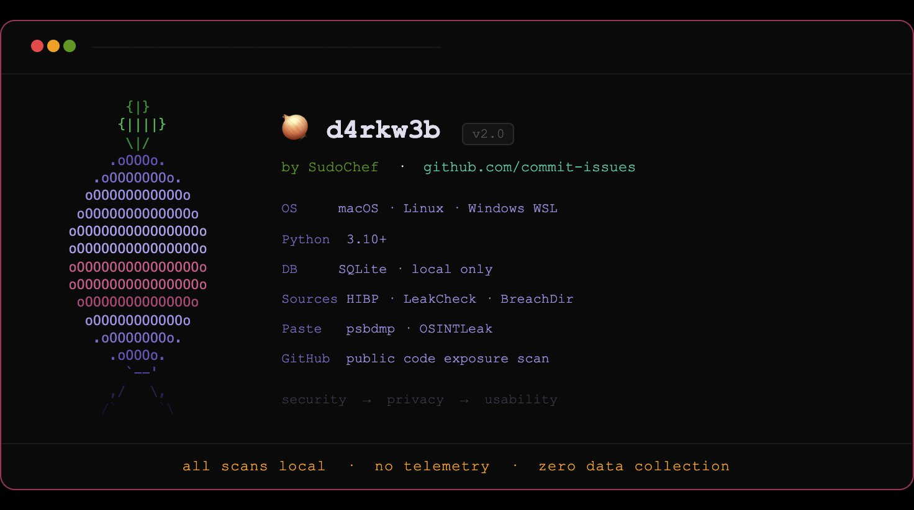

<div align="center">



# 🧅 d4rkw3b
### darkweb-exposure-toolkit

[](https://python.org)
[](LICENSE)
[](#)
[](#)
[](https://github.com/commit-issues)

**A privacy-first, terminal-based personal data exposure monitor.**

*Check if your information has been leaked, sold, or exposed — without leaving your terminal, without paying a subscription, and without handing your data to another company in the process.*

</div>

---

## The Problem

When you use other sites to check if your data was breached:

- 💸 You pay
- 🔍 You hand *another* company your information while trying to clean up the first ones
- 🌐 Your query leaves your machine and hits their servers

**d4rkw3b solves all three.** Everything runs locally. Results stay on your device. Nothing phones home.

---

## What It Checks

No passwords required. All checks use publicly indexed breach data — the same approach used by Google One, IntelX, and similar services.

| Target | Method | Stored in .env |
|---|---|---|
| Email addresses | HIBP breach lookup | ✅ Yes |
| Usernames | HIBP + GitHub public code scan | ✅ Yes |
| Phone numbers | HIBP breach lookup | ✅ Yes |
| Platform usernames | HIBP + paste sites (Discord, Steam, Reddit, Instagram + more) | Runtime prompt |
| Passwords | k-anonymity — only 5-char hash prefix transmitted, never your full password | Runtime prompt |
| API tokens & keys | GitHub public code exposure scan | Runtime prompt |

---

## Architecture & Privacy Model

| Layer | Approach |
|---|---|
| **Breach checks** | HIBP k-anonymity API — only a 5-char SHA-1 hash prefix is transmitted, never your full password |
| **Paste site checks** | Clearnet only — breach data surfaces on clearnet fast, no dark web access needed or used |
| **Local cache** | 24hr breach intelligence cache stored in SQLite on your machine — most searches never hit the network |
| **Offline mode** | Search local cache with zero network exposure after first run |
| **Dark web crawling** | Not included by design — public breach intelligence is sufficient and legally clean |

> **Security → Privacy/OPSEC → Usability.**
> That is the order of priority in every decision this tool makes.

### A note on SHA-1

The password k-anonymity check uses SHA-1 hashing. This is not a security decision — it is a requirement of the [HIBP k-anonymity API protocol](https://haveibeenpwned.com/API/v3#PwnedPasswords). Only the first 5 characters of the hash are ever transmitted. Your full password never leaves your machine. `usedforsecurity=False` is set explicitly in the code to document this intent.

---

## Data Sources — Free Tiers Only

This tool is built entirely on free, public APIs. No hidden costs. No subscriptions required.

> All sources included at time of development use free tiers only.
> If you need deeper intelligence, see the **Premium Tools** section below.

| Source | Checks | API Key Required |
|---|---|---|
| HaveIBeenPwned | Email, username, phone — breach history | Yes (free at haveibeenpwned.com/API/Key) |
| LeakCheck | Email, username, phone — 7B+ records | No (free tier) |
| BreachDirectory | Email, username — passwords and hashes | No (free) |
| Emailrep.io | Email — reputation, breach history, social profiles | Yes (free at emailrep.io/key) |
| OSINTLeak | Email, username — stealer logs, dark web forums | Yes (free starter at osintleak.com) |
| psbdmp.ws | Email, username — paste site dumps | No |

---

## Platform Coverage

| Category | Platforms |
|---|---|
| 🎮 Gaming | Steam, PlayStation Network, Xbox, Roblox, Twitch |
| 💬 Social | Discord, Reddit, Twitter/X, Instagram, TikTok, Facebook, LinkedIn, Snapchat, YouTube, Telegram, Spotify |
| 👩‍💻 Developer | GitHub |

---

## 🚀 Quick Start

### Prerequisites
- Python 3.10+
- Terminal (macOS, Linux, or Windows WSL2)

### Installation

**macOS / Linux:**
```bash
git clone https://github.com/commit-issues/darkweb-exposure-toolkit.git
cd darkweb-exposure-toolkit
pip3 install -r requirements.txt --break-system-packages
cp .env.example .env
```

**Windows (PowerShell):**
```powershell
git clone https://github.com/commit-issues/darkweb-exposure-toolkit.git
cd darkweb-exposure-toolkit
pip install -r requirements.txt
copy .env.example .env
```

Open `.env` in any text editor and fill in your values.

> 📖 **New to this?** See the full step-by-step guide: [docs/setup.md](docs/setup.md)

```bash
HIBP_API_KEY=your_key_here
GITHUB_TOKEN=your_token_here
EMAILS_TO_CHECK=you@example.com
USERNAMES_TO_CHECK=yourusername
PHONES_TO_CHECK=+12125551234
```

### Run

```bash
python3 src/run_all_checks.py
```

Force a cache refresh before scanning:

```bash
python3 src/run_all_checks.py --refresh
```

---

## 📂 Project Structure
darkweb-exposure-toolkit/
│
├── .env.example              ← Copy to .env, fill in your keys
├── .gitignore                ← Protects .env and data/ from commits
├── requirements.txt
├── setup.cfg                 ← Linter configuration
├── NOTICE                    ← Attribution — required to keep on forks
│
├── src/
│   ├── run_all_checks.py     ← Main entry point
│   ├── tui.py                ← Terminal UI, banner, pulse spinner
│   ├── hibp_check.py         ← HIBP breach + k-anonymity password check
│   ├── github_search.py      ← GitHub public code exposure scan
│   ├── platform_check.py     ← Platform username checks (Discord, Steam + more)
│   ├── breach_scraper.py     ← Multi-source breach intelligence scraper
│   ├── scheduler.py          ← 24hr cache refresh scheduler
│   ├── validator.py          ← Input validation and sanitization
│   ├── notifier.py           ← Console output formatter
│   ├── db_utils.py           ← Local SQLite operations
│   ├── init_db.py            ← Database setup
│   └── verify.py             ← Integrity verification
│
└── data/                     ← Local results DB (gitignored)

---

## 🔐 Privacy & Safety

- All results stored **locally only** in `data/exposure.db`
- Your `.env` file is in `.gitignore` — it will never be committed
- Delete `data/exposure.db` at any time to wipe all local results
- No telemetry, no analytics, no third-party data collection
- Passwords use **k-anonymity** — your full password hash never leaves your machine
- Tokens and keys are entered at **runtime only** and never written to disk

---

## 🔒 Premium Tools — When You Need More

These tools are used by law enforcement, private investigators, security researchers, and journalists for deeper investigations. They are **not included** in this tool — no paid services are ever called without your explicit configuration.

| Tool | Used By | Free Tier | API | Best For |
|---|---|---|---|---|
| IntelX (intelx.io) | Law enforcement, Bellingcat, journalists | 10 results/search | Paid | Dark web indexing, full breach records, historical WHOIS |
| OSINT Industries | 5,000+ law enforcement departments | No | Paid | Real-time social footprint across 1,500+ sources |
| DeHashed | Security researchers, pentesters | Basic only | Paid | Largest breach database — IP, email, username, address |
| Snusbase | Developers, researchers | No | Paid | Fast cleartext passwords, hashes, salts, IPs |
| LeakCheck Pro | OSINT researchers | Limited | Paid | 7B+ records with full credential detail |
| OSINTLeak Pro | Security teams, law enforcement | Free starter | Paid | Stealer logs, continuous monitoring, dark web forums |

### Example Use Cases

**Your Discord got compromised and you want to trace it:**
→ Start here (free, local, private) → If you need full credential history: LeakCheck Pro or DeHashed

**You're a journalist investigating a public figure:**
→ IntelX for dark web indexing and historical WHOIS
→ OSINT Industries for social footprint across 1,500+ sources

**You're a security researcher doing a full OSINT sweep:**
→ DeHashed + Snusbase for deepest credential coverage

**You're a PI or law enforcement:**
→ OSINT Industries (used by 5,000+ departments worldwide)
→ IntelX for dark web and archived content

**You just want to check your personal exposure for free:**
→ This tool. That's what it's for.

---

## 📚 Resources & Related Guides

| Guide | Link |
|---|---|
| Full setup guide (API keys, step by step) | [docs/setup.md](docs/setup.md) |
| GitHub account + SSH setup | [secure-your-repo](https://github.com/commit-issues/secure-your-repo) |
| Code audit standards | [code-audit](https://github.com/commit-issues/code-audit) |

---

## ⚠️ Legal & Ethical Use

This tool is for **personal security awareness only**.

✅ Check your own accounts and credentials
✅ Educational use and learning
✅ Personal OPSEC and exposure monitoring
❌ Do not scan accounts you do not own
❌ Do not use for bulk or automated scanning of others

---

## 🛡️ Security & Quality

All source files pass the full audit stack:

`black` · `flake8` · `pylint 10/10` · `mypy` · `bandit` · `pip-audit` · `detect-secrets` · `vulture` · `radon`

Dependencies are pinned and CVE-free at time of release.

---

## 📜 Attribution & Forks

Original author: **SudoCode by SudoChef** (`commit-issues`)
Original repo: `https://github.com/commit-issues/darkweb-exposure-toolkit`
Created: April 2025

If you fork or build upon this work, you are required to retain the `NOTICE` file and original copyright notice in `LICENSE` per MIT License terms. Authorship is embedded in the source code, database, and signed git history.

---

## 📜 License

MIT — see [LICENSE](LICENSE).

---

<div align="center">

**Built by [SudoCode](https://github.com/commit-issues)**

*Security first. Privacy always.*

</div>
